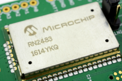
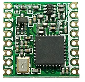

# Mbed LoRaWAN Transceiver Library

An simple wrapper around the LoRaWAN classes of Mbed. It provides a simpler callback mechanism and allows for easy sending and receiving of messages.

## Starting

Create a new mbed app:

```shell
mbed new lora-demo
```

Add the library as a dependency

```shell
mbed add https://github.com/BioBoost/lorawan-transceiver
```

Add an `mbed_app.json` configuration file and setup your OTAA keys:

```shell
{
  "macros": ["ENABLE_LORA_LOGGING"],
  "target_overrides": {
    "*": {
      "lora.over-the-air-activation": true,
      "lora.phy": "EU868",
      "lora.device-eui": "{ 0x00, 0x00, 0x00, 0x00, 0x00, 0x00, 0x00, 0x00 }",
      "lora.application-eui": "{ 0x00, 0x00, 0x00, 0x00, 0x00, 0x00, 0x00, 0x00 }",
      "lora.application-key": "{ 0x00, 0x00, 0x00, 0x00, 0x00, 0x00, 0x00, 0x00, 0x00, 0x00, 0x00, 0x00, 0x00, 0x00, 0x00, 0x00 }"
    }
  }
}
```

Checkout the `examples` folder for some code examples.

## Dependencies

Depends on the Semtech LoRa/FSK radio driver library which can be found at [https://github.com/ARMmbed/mbed-semtech-lora-rf-drivers](https://github.com/ARMmbed/mbed-semtech-lora-rf-drivers). This library provides drivers for both the Semtech SX1272 and SX1276 LoRa radio chips.

The SX1276 is found on for example the RFM95W module commonly used. This chip does not implement the LoRaWAN protocol stack (in contrast to for example the Microchip RN2483).

| Microchip RN2483 | RFM95W |
|     :---:      |     :---:      |
|  |  |
| Has an On-board LoRaWAN protocol stack | LoRa Radio transceiver, requires LoRaWAN software stack |

## Changelog

* 0.1.0
  * Allow callback registration
  * Basic send
  * External Event Queue